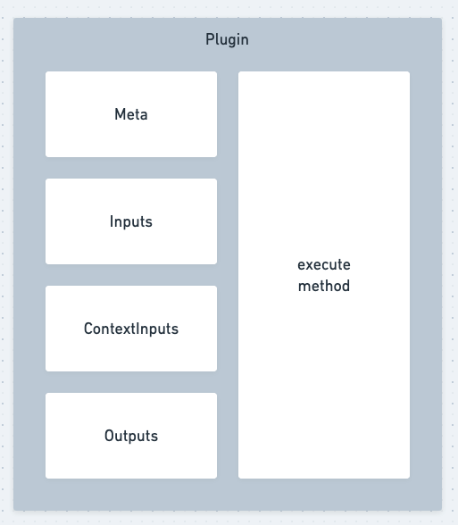
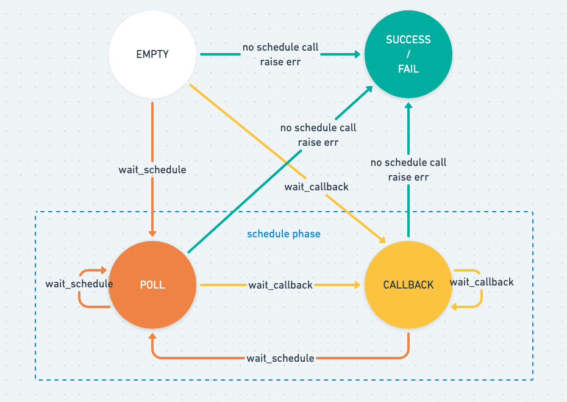

# 🧐 bk-plugin-framework-go

bk-plugin-framework-go 是一个轻量化系统插件开发框架，开发者只需要使用该框架进行插件开发，并将其部署到蓝鲸 PaaS 平台上，即可完成系统插件的开发和接入。

接入系统通过调用 bk-plugin-framework-go 暴露出来的标准接口，完成系统插件功能的实现。


## 接入蓝鲸插件服务
传送门: [BK-PLUGIN-CLIENT-GO](https://github.com/TencentBlueKing/bk-plugin-client-go)

## 插件构成

一个插件由以下元素构成

- Meta：插件元数据
- Inputs：插件调用输入模型
- ContextInputs：插件调用上下文输入模型
- Outputs：插件输出模型
- execute method：插件调用逻辑



## 插件目录结构
```text
├── Procfile
├── app_desc.yml
├── bin
│   ├── pre_compile
│   └── post_compile
├── bk_plugin
│   ├── v100
│       └── plugin.go
├── app.json
├── go.mod
├── main.go
```

## 你需要关注的
bk_plugin：存放每个版本的插件执行代码，所有插件定义必须位于该目录下，目录下文件名不做限制，框架会自动从该目录下发现插件。   
go.mod: 存放当前插件运行需要的依赖版本。

### 你不需要（不应该）关注的

- Procfile：插件运行时进程定义文件
- app_desc.yml：插件描述文件
- bin/maange.py：运行时命令入口
- bin/post_compile：插件部署后置操作

## 一次插件调用的状态转换

一个插件在一次执行生命周期中可能会经过下图所示的状态转换，每种状态说明如下：

- EMPTY：初始状态，每次插件调用都会从这个状态开始
- SUCCESS：执行成功状态，插件在 `execute` 方法中如果没有抛出任何异常，没有 `self.wait_poll` 和 `self.wait_callback` 的调用，就会进入成功状态，**SUCCESS 是一次调用的结束状态**
- FAIL：执行失败状态，一旦插件在 `execute` 方法中抛出任何已知或不可预知的异常，都会进入失败状态，**FAIL 也是一次调用的结束状态**
- POLL：轮询状态，插件一旦在 `execute` 中调用了 `self.wait_poll` 方法，并且后续没有抛出异常，就会进入轮询状态，处于 POLL 状态的调用会在一定时间后被运行时拉起，并再次执行 `execute` 方法。
- CALLBACK：回调状态，插件一旦在 `execute` 中调用了 `self.wait_callback` 方法，并且后续没有抛出异常，就会进入回调状态，处于 CALLBACK 状态的插件会等待来自外部的回调，收到回调后，该次调用会被运行时拉起，并再次执行 `execute` 方法。

通过框架提供的方法，你可以在插件逻辑中进行任意合法的状态流转，以适配不同的业务场景



## 如何开发插件

一个完整的go的蓝鲸插件的结构应该如下:

 - 插件的表单定义部分，这部分指的是 `InputsForm`，这部分遵循jsonSchema协议，详情请查看:
 - 插件的输入部分，这部分指的是 `Inputs`
 - 插件的上下文部分，这部分对应的是 `ContextInputs`
 - 插件输出定义部分，这部分对应的是 `Outputs`
 - Version(), 插件的对应的获取版本的方法
 - Desc()，插件对象的获取描述的方法
 - Execute() 插件的执行方法，执行方法接收一个 Context 上下文对象。


```go
package v100

import (
	"github.com/TencentBlueKing/bk-plugin-framework-go/kit"
)

var InputsForm kit.Form = kit.Form{
	"template_id": kit.F{
		"ui:component": kit.F{"name": "bk-input", "props": kit.F{"type": "textarea"}},
		"ui:reactions": []kit.F{},
	},
}

type Inputs struct {
	TemplateID int    `json:"template_id" jsonschema:"title=模板 ID"`
}

type ContextInputs struct {
	BKBizID string `json:"bk_biz_id" jsonschema:"title=蓝鲸 CMDB ID"`
}

type Outputs struct {
	TaskID  int    `json:"task_id" jsonschema:"title=任务 ID"`
	TaskURL string `json:"task_url" jsonschema:"title=任务 URL"`
}

type Store struct {
	TaskID  int
	TaskURL string
}

type Plugin struct{}

func (p *Plugin) Version() string {
	return "1.0.0"
}

func (p *Plugin) Desc() string {
	return "执行标准运维作业"
}

func (p *Plugin) Execute(c *kit.Context) error {
	return nil
}
```
### 注册插件
在main.go 文件中，需要注册我们定义好的插件到hub中，可以同时注册多个不同版本到插件
```go
package main

import (
	v100 "bk-plugin-go/versions/v100"
	"github.com/TencentBlueKing/beego-runtime/runner"
	"github.com/TencentBlueKing/bk-plugin-framework-go/hub"
)

func main() {
	hub.MustInstall(&v100.Plugin{}, v100.Inputs{}, v100.ContextInputs{}, v100.Outputs{}, v100.InputsForm)
	runner.Run()
}
```

### 插件上下文
插件上下文 Context对象中的提供了一组方法, 可以读取插件所需要的状态，输入，上下文等信息。具体可以看如下示例。

```go
func (p *Plugin) Execute(c *kit.Context) error {
	// 读取插件状态对象
	state := c.State()
	switch state {
	// 如果插件状态为 constants.StateEmpty 则说明插件是第一次执行，此时执行的是execute逻辑
	case constants.StateEmpty:
		var inputs Inputs
		// c.ReadInputs(&inputs) 将插件的input 反序列化到对象中，这里的Inputs是我们上文中定义的Inputs
		if err := c.ReadInputs(&inputs); err != nil {
			return err
		}
                // 定义一个插件上下文对象
		var contextInputs ContextInputs
		// c.ReadContextInputs() 读取插件上下文到上文中定义的 ContextInputs 对象中
		if err := c.ReadContextInputs(&contextInputs); err != nil {
			return err
		}
		log.Printf("create sops task with %v and %v\n", inputs, contextInputs)

		// request with inputs
		taskID := 123
		taskURL := "task_url"
		outputs := Outputs{
			TaskID:  taskID,
			TaskURL: taskURL,
		}
		// 将插件的输出 Outputs 写入到 Outputs 中，调用c.WriteOutputs()
		if err := c.WriteOutputs(&outputs); err != nil {
			return err
		}
        
		// c.Write(obj) 将某个对象写入插件执行上下文中，当插件处于轮询逻辑时，将会读到
		store := Store{TaskID: taskID, TaskURL: taskURL}
		if err := c.Write(&store); err != nil {
			return nil
		}
                // 设置下一次轮询为5s之后
		c.WaitPoll(5)

		return nil
        // constants.StatePoll 表示此时插件处于轮询态
	case constants.StatePoll:
		
		var store Store
		// 读取在上文中写入的 Store 对象
		if err := c.Read(&store); err != nil {
			return nil
		}
		
		taskState := "RUNNING"
		if c.InvokeCount() >= 5 {
			taskState = "FINISHED"
		}

		switch taskState {
		case "RUNNING":
			c.WaitPoll(5)
		case "FAILED":
			return fmt.Errorf("task %v execute fail", store.TaskID)
		}
		return nil
	}
	return fmt.Errorf("invalid state %v", state)
}
```


### 我应该在什么时候开发一个新的插件版本？

如果你的插件发生了以下任一项或多项破坏性的改动，为了不影响插件现有版本的使用，请开发一个新版本插件：

- 插件的输入模型中`增加`了必填的输入参数
- 插件的输入模型中`删除`了必填的输入参数
- 插件的上下文输入模型中`增加`了必填的输入参数
- 插件的上下文输入模型中`删除`了必填的输入参数
- 插件的输出模型中`删除`了某个输出参数
- 插件的输出模型中某个输出参数的`类型`发生了变化
- 插件的表单`增加`了必填的参数
- 插件的表单`删除`了必填的参数
- 插件的表单`数据结构`发生了变化
- 插件的功能发生了翻天覆地的变化

### 定义插件执行逻辑
插件的 `execute` 方法定义了插件的执行逻辑，该方法必须接受两个输入参数：`inputs: Inputs` 与 `context: Context`。

### 执行错误

在插件执行过程中，如果遇到了需要让本次调用进入失败状态的情况（例如，外部接口调用失败），可以通过抛出 返回一个 `err对象` 来让插件进入失败状态

```go
func (p *Plugin) Execute(c *kit.Context) error {
    return fmt.Errorf("error")
}
```

### 等待调度
在某些场景下，依次调用执行的任务可能会耗费很长时间，这时候如果一直在 execute 中使用 while 来等待是不太合适的，此时我们可以调用 context.WaitPoll(interval) 方法来让本次调用进入等待调度状态，当 wait_poll 调用成功且 execute 正常返回后，execute 方法会在 interval 秒后被再次拉起执行。
可以通过获取context对象的State()方法来获取当前的执行状态。

状态有以下几种情况:
```go
const (
    StateEmpty    State = 1
    StatePoll     State = 2
    StateCallback State = 3
    StateSuccess  State = 4
    StateFail     State = 5
)

```

```go
func (p *Plugin) Execute(c *kit.Context) error {
	// 读取插件状态对象
	state := c.State()
	switch state {
	// 如果插件状态为 constants.StateEmpty 则说明插件是第一次执行，此时执行的是execute逻辑
	case constants.StateEmpty:
		c.WaitPoll(5)
        // 设置下一次轮询为5s之后
		return nil 
    // constants.StatePoll 表示此时插件处于轮询态
	case constants.StatePoll:
		return nil
	}
	return fmt.Errorf("invalid state %v", state)
```

### 执行成功
若 execute 中如果没有抛出任何异常，没有 context.wait_poll 和 context.wait_callback 的调用，就会进入成功状态


### inputs 输入参数说明
插件的input需要定义两份数据，一份是插件input对应的结构体，一份是插件input对应的jsonschema定义。具体使用参数参考jsonschema规范。
以下实例定义了两个输入，其中task_name 是一个下拉框，下拉框的数据源是dataSource对象

```go
var dataSource = map[string]string{"label": "测试", "value": "测试"}

var InputsForm kit.Form = kit.Form{
	"template_id": kit.F{
		"ui:component": kit.F{"name": "bk-input", "props": kit.F{"type": "textarea"}},
		"ui:reactions": []kit.F{},
	},
	"task_name": kit.F{
		"ui:component": kit.F{"name": "select", "props": kit.F{"type": "select", "datasource": []map[string]string{dataSource}}},
		"ui:reactions": []kit.F{},
	},
}

type Inputs struct {
	TemplateID int    `json:"template_id" jsonschema:"title=模板 ID"`
	TaskName   string `json:"task_name" jsonschema:"title=任务名"`
}
```

## 🔬如何在本地调试插件
环境准备:
请确保本地已经安装了go 16+ 版本的sdk。同时安装了以下组件:
- redis: 要求redis版本为4.0+。

后续的所有命令操作，请确保当前会话中存在以下环境变量:
```bash
export REDIS_HOST="127.0.0.1" # 默认为127.0.0.1
export REDIS_PORT="6079" # 默认为6079
export REDIS_PASSWORD="" # 默认为空
```

启动调试进程:
1. 执行bee run 命令，生成对应的二进制命令，如 bk-plugin-go
2. 启动web服务
```go
// web
bk-plugin-go server
// worker
bk-plugin-go worker
```

## 各系统插件开发说明

### 标准运维

在开发标准运维系统插件时，可以在上下文输入中定义这些字段，标准运维会根据当前流程任务执行的上下文传入插件中：

- project_id(int)：当前任务所属标准运维项目ID
- project_name(str)：当前任务所属标准运维项目名
- bk_biz_id(int)：当前任务所属 CMDB 业务 ID
- bk_biz_name(str)：当前任务所属 CMDB 业务名
- operator(str)：当前任务操作者（点击开始按钮的人）
- executor(str)：当前任务执行人（调用第三方系统 API 使用的身份）
- task_id(int)：当前任务 ID
- task_name(str)：当前任务名

### Support

- [蓝鲸论坛](https://bk.tencent.com/s-mart/community)
- [蓝鲸 DevOps 在线视频教程](https://bk.tencent.com/s-mart/video/)
- 联系我们，技术交流QQ群：


### BlueKing Community

- [BK-CI](https://github.com/Tencent/bk-ci)：蓝鲸持续集成平台是一个开源的持续集成和持续交付系统，可以轻松将你的研发流程呈现到你面前。
- [BK-BCS](https://github.com/Tencent/bk-bcs)：蓝鲸容器管理平台是以容器技术为基础，为微服务业务提供编排管理的基础服务平台。
- [BK-PaaS](https://github.com/Tencent/bk-PaaS)：蓝鲸PaaS平台是一个开放式的开发平台，让开发者可以方便快捷地创建、开发、部署和管理SaaS应用。
- [BK-SOPS](https://github.com/Tencent/bk-sops)：标准运维（SOPS）是通过可视化的图形界面进行任务流程编排和执行的系统，是蓝鲸体系中一款轻量级的调度编排类SaaS产品。
- [BK-CMDB](https://github.com/Tencent/bk-cmdb)：蓝鲸配置平台是一个面向资产及应用的企业级配置管理平台。

### Contributing

如果你有好的意见或建议，欢迎给我们提 Issues 或 Pull Requests，为蓝鲸开源社区贡献力量。

1. 本项目使用 [Poetry](https://python-poetry.org/) 进行开发、构建及发布，本地开发环境搭建请参考 Poetry 官方文档
2. PR 需要通过 CI 中的所有代码风格检查，单元测试及集成测试才可被接受合并
3. 新增加的模块请确保完备的单元测试覆盖

### License

基于 MIT 协议， 详细请参考[LICENSE](LICENSE.txt)
